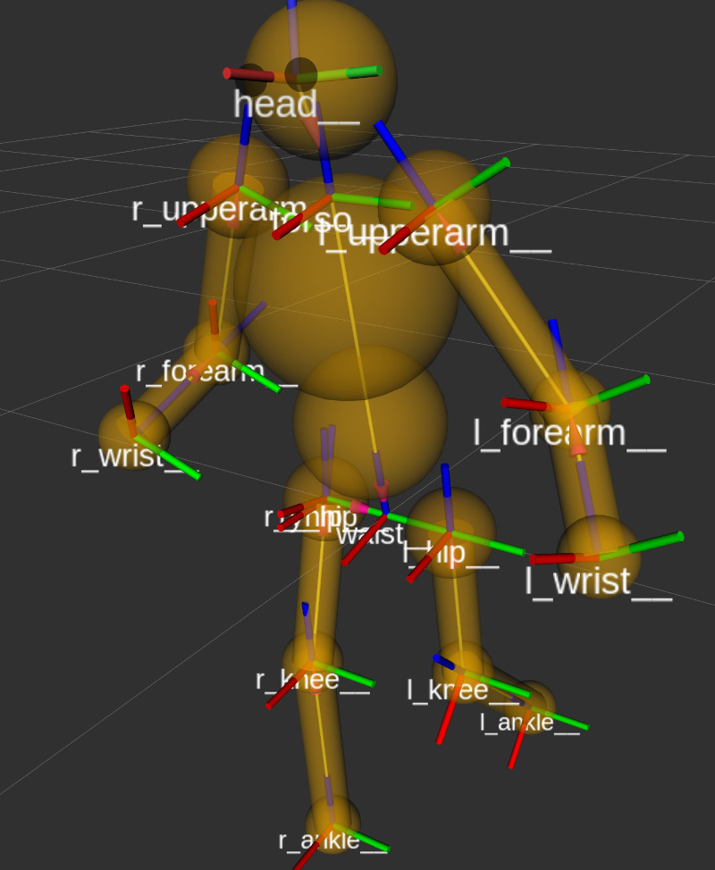

ROS4HRI project
===============

[](https://travis-ci.com/ros4hri/ros4hri)



This repository is the main entry point to the ROS4HRI framework. ROS4HRI is a
set of [ROS](https://www.ros.org) messages and nodes to facilitate building
interactive robots, while supporting code sharing and replicability amongst the
community.

**In order to understand how humans are represented and can be accessed, we
highly recommend you to have a look at the paper presenting ROS4HRI framework.**

The ROS4HRI platform is currently made of:

- [the hri_msgs package](https://github.com/ros4hri/hri_msgs): the reference
  implementation of the ROS for HRI interfaces (ie, ROS messages)
- [hri_skeletons](https://github.com/ros4hri/hri_skeletons): a suite of nodes to
  track and represent bodies
- [hri_faces](https://github.com/ros4hri/hri_faces): a suite of nodes to
  track and extract facial features
- [hri_matcher](https://github.com/ros4hri/hri_matcher): a node identifying and
  maintaining matchs between skeletons and faces.

Additional resources and background design is available on the
[wiki](https://github.com/ros4hri/ros4hri/wiki).

Installation
------------


Tested on Ubuntu 18.04. Some dependencies (like OpenVINO) do not yet support Ubuntu 20.04, causing various non-trivial issues at installation time.

### Dependencies


#### ROS Melodic + ROS Python 3

If not already installed, install ROS Melodic [following the official instructions](http://wiki.ros.org/Installation/Ubuntu).


OpenVINO requires Python3 and we need to compile some nodes with Python3 support.

- install `catkin` for Python3:
```
$ sudo pip3 install rospkg catkin_pkg
```

- we need to recompile `cv_bridge` to work with Python3:

```
$ cd ~ && mkdir dev && mkdir src && cd src
$ git clone https://github.com/ros-perception/vision_opencv.git
$ cd vision_opencv/cv_bridge
$ mkdir build && cd build
$ cmake -DPYTHON_EXECUTABLE=/usr/bin/python3 -DPYTHON_INCLUDE_DIR=/usr/include/python3.6m -DPYTHON_LIBRARY=/usr/lib/x86_64-linux-gnu/libpython3.6m.so -DCMAKE_BUILD_TYPE=Release -DCMAKE_INSTALL_PREFIX=~/dev ..
$ make && make install
```

Then, add the following two lines to your `.bashrc`:

```
source $HOME/dev/setup.bash
export PYTHONPATH=$HOME/dev/lib/python3/dist-packages:$PYTHONPATH
```

#### OpenVINO

*Tested with OpenVINO 2020.4*

Follow [*all* the official steps](https://docs.openvinotoolkit.org/2020.4/openvino_docs_install_guides_installing_openvino_linux.html). The rest of this guide assumes OpenVINO is installed as root, under `/opt/intel/openvino/` (itself a symbolic link to `/opt/intel/openvino_<latest version>`)

In particular:

- don't forget to modify your `.bashrc` to source the OpenVINO variables
- OpenVINO suggests by default to install an Intel-optimized version of OpenCV. *Do it* as Ubuntu 18.04 comes with OpenCV 3.2 (used by ROS melodic), but OpenFACE requires a more recent version of OpenCV.

*As such, your system will need 2 versions of OpenCV: the system-provided OpenCV3.2 (used by ROS), and OpenCV4.2, installed by OpenVINO, and used by OpenVINO and OpenFace. That custom opencv can be found in `/opt/intel/openvino/opencv`.*

#### OpenVINO models

ROS4HRI requires the following OpenZoo models:

- reidentification
- age gender
- emotion recognition
- 3d pose estimation

To download them (as well as their depedent models). They will be stored in `$HOME/openvino_models` (this is the default location suggested by OpenVINO, and the location where the ROS nodes expect them to be. If you change it, you will need to adjust accordingly the various launch files).

```
$ cd /opt/intel/openvino/deployment_tools/open_model_zoo/tools/downloader
$ ./downloader.py --name human-pose-estimation-0001,human-pose-estimation-3d-0001,head-pose-estimation-adas-0001,face-detection-adas-0001,age-gender-recognition-retail-0013,emotions-recognition-retail-0003,person-detection-retail-0013,person-reidentification-retail-0270 -o ~/openvino_models/
```

Some models need to be converted to OpenVINO IR:

```
$ python3 -mpip install --user -r ./requirements-pytorch.in
$ ./converter.py --name human-pose-estimation-3d-0001 -d ~/openvino_models/
```

#### Check OpenVINO works

To check OpenVINO is correctly installed, you can run one of their demo. In a new terminal (to make sure the OpenVINO env variable are sourced), run:

```
$ cd ~/inference_engine_demos_build/human_pose_estimation_demo
$ make
```
Then:
```
$ cd ~/inference_engine_demos_build/intel64/Release/
$ ./human_pose_estimation_demo -m ~/openvino_models/intel/human-pose-estimation-0001/FP16/human-pose-estimation-0001.xml
```

You should see something like that:


#### openFace

Follow the [instructions here](https://github.com/TadasBaltrusaitis/OpenFace/wiki/Unix-Installation).


### hri_msgs


Contains all the custom HRI messages required by the other nodes.

You can clone it here:

```
$ git clone https://github.com/ros4hri/hri_msgs.git
```

and install it as any standard ROS package.

See [`hri_msgs` documentation](https://github.com/ros4hri/hri_msgs/blob/master/README.md#installation) for details if needed.

### hri_skeletons


See the [hri_skeletons documentation](https://github.com/ros4hri/hri_skeletons).


Sensors
-------

The ROS4HRI pipeline does not require any specific imaging sensor; it actually only a monocular RGB source of image. The Azure Kinect has been found to perform particularly well, and the ROS driver is officially supported by Microsoft.

### Webcam

The whole pipeline can be tested using a simple webcam.

For instance:

```
$ rosrun usb_cam usb_cam
```

### Azure Kinect installation


- install the [Azure Kinect SDK debian packages](https://github.com/microsoft/Azure-Kinect-Sensor-SDK/blob/develop/docs/usage.md#debian-package)
- the [ROS driver](https://github.com/microsoft/Azure_Kinect_ROS_Driver) can then be easily installed, as a regular ROS package.


